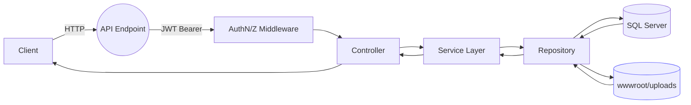
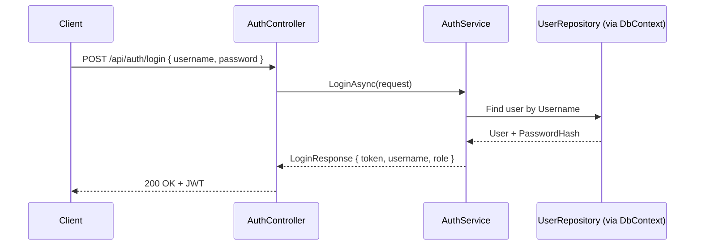

# WorkTrack Lite – Architecture Diagrams (Mermaid)

This document provides Mermaid syntax for ER diagram and key request/feature flows. Paste these blocks into any Mermaid-compatible renderer (e.g., GitHub, VS Code extensions, Mermaid Live).

## 1) Entity Relationship Diagram

```mermaid
erDiagram
    USER {
      int Id PK
      string Username
      string Email
      string PasswordHash
      string Role  // Admin | Member
      datetime CreatedOn
    }

    PROJECT {
      int Id PK
      string Name
      string Description
      string Status  // Active | Inactive
      datetime CreatedOn
      datetime UpdatedOn
    }

    ISSUE {
      int Id PK
      int ProjectId FK
      string Title
      string Description
      string Status    // Open | InProgress | Resolved | Closed
      string Priority  // Low | Medium | High
      int ReporterId FK
      int AssigneeId FK nullable
      datetime DueDate nullable
      datetime CreatedOn
      datetime UpdatedOn nullable
    }

    COMMENT {
      int Id PK
      int IssueId FK
      int AuthorId FK
      string Content
      datetime CreatedOn
    }

    ATTACHMENT {
      int Id PK
      int IssueId FK
      string FileName
      string FilePath
      string ContentType nullable
      int UploadedById FK
      datetime UploadedOn
    }

    PROJECT ||--o{ ISSUE : "contains"
    USER ||--o{ ISSUE : "reports (ReporterId)"
    USER ||--o{ ISSUE : "assigned to (AssigneeId)"
    ISSUE ||--o{ COMMENT : "has"
    USER ||--o{ COMMENT : "writes (AuthorId)"
    ISSUE ||--o{ ATTACHMENT : "has"
    USER ||--o{ ATTACHMENT : "uploads (UploadedById)"
```

Notes:
- Enums are serialized as strings in responses.
- Attachments are stored under wwwroot/uploads; API returns metadata.

---

## 2) Request Lifecycle (High Level)



- OpenAPI/Scalar UI exposed in Development at /scalar/v1
- Static files middleware serves uploads for GETs

---

## 3) Auth: Login Flow



- JWT config from appsettings.json (Issuer, Audience, Key)
- Use Authorization: Bearer {token} for secured endpoints

---

## 4) Projects: List with Sorting & Paging

```mermaid
flowchart TD
    C[Client] -->|GET /api/projects?sortBy=&sortDir=&pageNumber=&pageSize=| PCTRL[ProjectsController]
    PCTRL --> PSVC[ProjectService.GetAllAsync()]
    PSVC --> PREPO[ProjectRepository.GetAllAsync()]
    PREPO --> DB[(SQL Server)]
    DB --> PREPO --> PSVC
    PSVC --> PCTRL
    PCTRL -->|ApplyProjectSorting + ApplyPaging| C
```

- sortBy: createdOn | name | status | issueCount
- sortDir: asc | desc
- Defaults: pageNumber=1, pageSize=20 (1..100)

---

## 5) Issues: Create (Validation + Command)

```mermaid
flowchart TD
    C[Client] -->|POST /api/projects/{projectId}/issues| ICTRL_1_1_1[IssuesController.Create]
    ICTRL_1_1_1 --> ISVC[IssueService.CreateAsync]
    ICTRL_1_1_1 -->|validate project exists| ISVC
    ICTRL_1_1_1 -->|validate assignee (if provided)| ISVC
    ISVC --> IREPO[IssueRepository.AddAsync + SaveChanges]
    IREPO --> DB[(SQL Server)]
    DB --> IREPO --> ISVC --> ICTRL_1_1_1 -->|201 Created + IssueResponse| C
```

Validation rules:
- 404 if Project not found
- 400 if AssigneeId provided but user not found
- Status initialized as Open; timestamps set in service

---

## 6) Issues: Filter, Sort, Paginate (Project-Scoped and Global)

```mermaid
flowchart TD
    C[Client] -->|GET /api/projects/{projectId}/issues?status=&priority=&assigneeId=&search=&dueBefore=&pageNumber=&pageSize=&sortBy=&sortDir=| ICTRL[IssuesController.GetAll]
    ICTRL --> ISVC[IssueService.GetAllByProjectAsync]
    ISVC --> IREPO[IssueRepository.GetAllByProjectAsync]
    IREPO -->|ApplyIssueFilters| QF[QueryExtensions.ApplyIssueFilters]
    IREPO -->|ApplyIssueSorting| QS[QueryExtensions.ApplyIssueSorting]
    IREPO -->|ApplyPaging| QP[QueryExtensions.ApplyPaging]
    QF --> QS --> QP --> DB[(SQL Server)] --> IREPO --> ISVC --> ICTRL --> C
```

Global listing:
- GET /api/issues uses same filter/sort/page; optionally filter.ProjectId

Issues sortBy allowed:
- createdOn, updatedOn, dueDate, priority, status, title, assigneeName

---

## 7) Comments: Add and Delete

```mermaid
flowchart LR
    C[Client] -->|POST /api/issues/{issueId}/comments| CCTRL[CommentsController.Create]
    CCTRL --> CSVCS[CommentService.CreateAsync]
    CSVCS --> CREPO[CommentRepository + SaveChanges]
    CREPO --> DB[(SQL Server)]
    DB --> CREPO --> CSVCS --> CCTRL --> C

    C -.->|DELETE /api/issues/{issueId}/comments/{id}| CCTRL_DEL[CommentsController.Delete]
    CCTRL_DEL --> CSVCS_DEL[CommentService.DeleteAsync]
    CSVCS_DEL -->|author or Admin| CREPO
    CREPO --> DB --> CSVCS_DEL --> CCTRL_DEL --> C
```

---

## 8) Attachments: Upload and Delete

```mermaid
flowchart TD
    C[Client] -->|POST multipart/form-data /api/issues/{issueId}/attachments/upload| ACTRL[AttachmentsController.Upload]
    ACTRL --> ASVC[AttachmentService.UploadAsync]
    ASVC -->|validate issue exists| AREPO
    ASVC -->|save file to wwwroot/uploads| FS[(Static Files)]
    ASVC -->|persist metadata| AREPO[AttachmentRepository + SaveChanges]
    AREPO --> DB[(SQL Server)]
    DB --> AREPO --> ASVC --> ACTRL -->|201 Created + AttachmentResponse| C

    C -->|DELETE /api/issues/{issueId}/attachments/{id}| ACTRL_DEL[AttachmentsController.Delete]
    ACTRL_DEL --> ASVC_DEL[AttachmentService.DeleteAsync (uploader or Admin)]
    ASVC_DEL --> AREPO_DEL[Delete + SaveChanges] --> DB
```

---

## 9) Error Handling & Auth Pipeline

```mermaid
flowchart LR
    REQ[Request] --> EX[ExceptionMiddleware]
    EX --> AUTHN[JWT Authentication]
    AUTHN --> AUTHZ[Authorization (Roles/Policies)]
    AUTHZ --> ROUTE[MapControllers]
    ROUTE --> RES[Response]
```

- Centralized exception handling via ExceptionMiddleware returns consistent error payloads.

---
