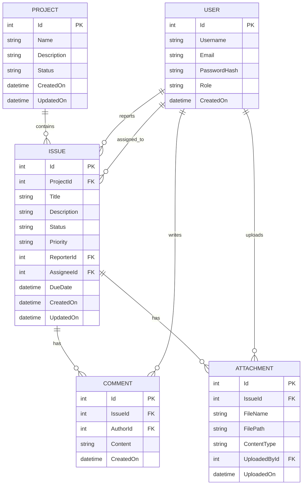
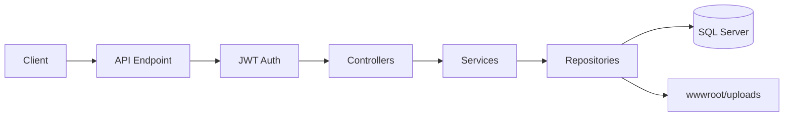
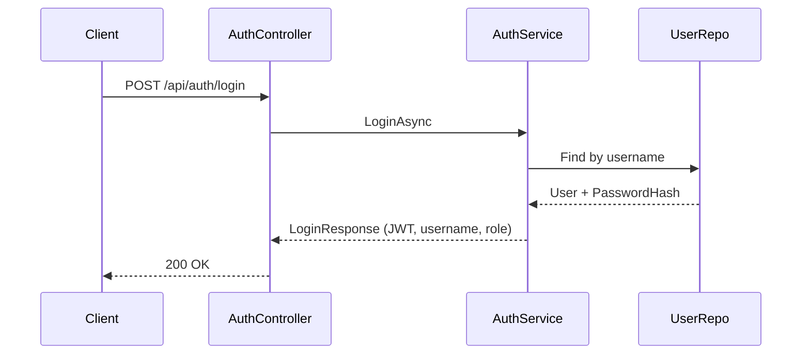
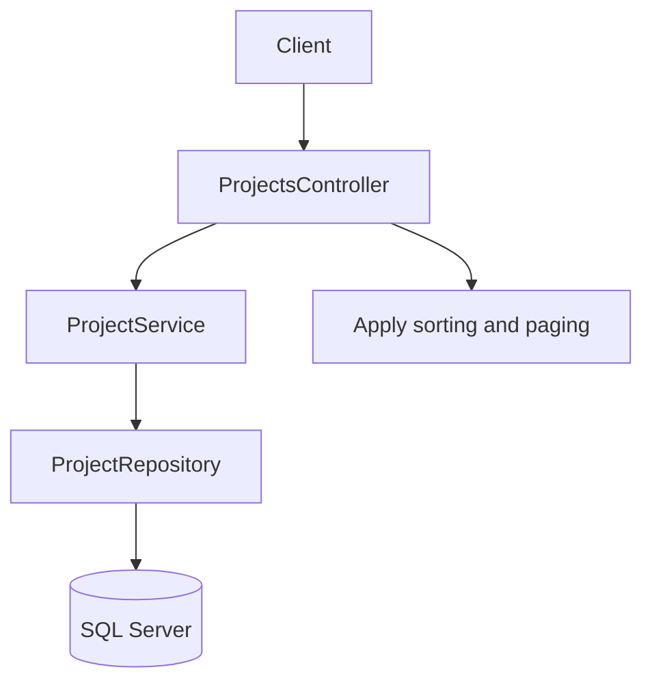
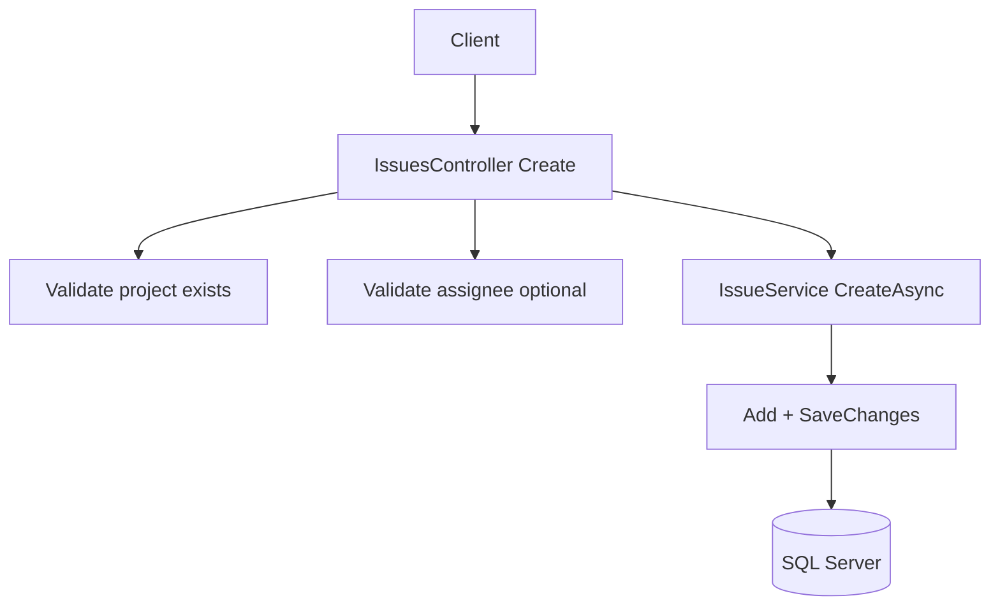
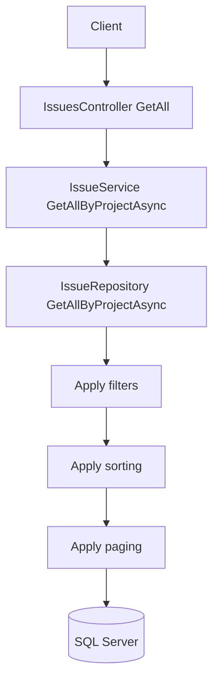
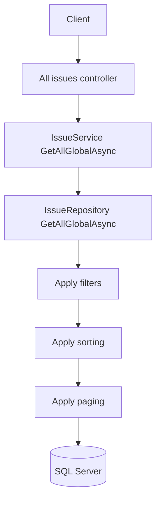
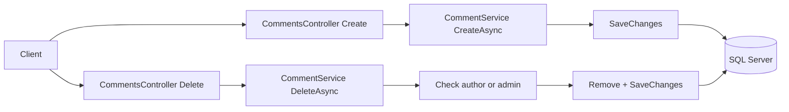
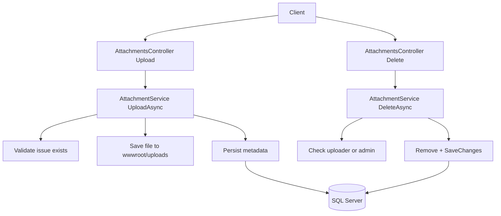

# WorkTrack Lite – Architecture Diagrams (Mermaid)

These Mermaid blocks are simplified to be GitHub-safe (no inline comments in ERD fields, no special characters in flow labels). Paste them directly in GitHub Markdown or any Mermaid renderer.

## 1) Entity Relationship Diagram (ERD)



Notes:
- Status and Priority are enums represented as strings in API responses.
- AssigneeId and DueDate may be null in the database model, represented here without nullability to keep Mermaid syntax simple.

---

## 2) Request Lifecycle (High Level)



---

## 3) Auth: Login Flow (Sequence)



---

## 4) Projects: List with Sorting and Paging



- SortBy: createdOn, name, status, issueCount
- SortDir: asc, desc
- PageNumber default 1, PageSize default 20 (min 1, max 100)

---

## 5) Issues: Create



---

## 6) Issues: Filter, Sort, Paginate (Project Scoped)



- Filters: status, priority, assigneeId, search, dueBefore
- SortBy: createdOn, updatedOn, dueDate, priority, status, title, assigneeName
- Pagination: pageNumber, pageSize

---

## 7) Issues: Global Listing



---

## 8) Comments: Add and Delete



---

## 9) Attachments: Upload and Delete



---

## 10) Error Handling and Auth Pipeline

```mermaid
flowchart LR
    Request --> ExceptionMiddleware
    ExceptionMiddleware --> Authentication
    Authentication --> Authorization
    Authorization --> MapControllers
    MapControllers --> Response

    Request[Request]
    Authentication[JWT Authentication]
    Authorization[Authorization]
    MapControllers[Route to controllers]
    Response[Response]
